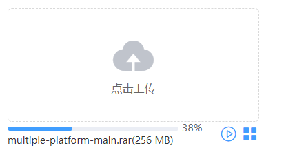

# 大文件上传组件

【源码】：https://github.com/MooreLxr/big-file-upload

## 一、问题描述
想必大家都遇到过在上传一个大文件时，上传时间漫长，上传失败，让你重新上传！！！不能忍......

传统上传文件的方式显然不适用，因此大文件上传应运而生

## 二、前端实现原理
1.文件分片：前端运用 Blob Api的 file.slice() 对大文件进行切割

2.点击开始上传，计算文件md5值（spark-md5插件），发送服务端验证文件存在性

3.文件秒传：如果服务器已存在该文件，则将上传结果置为成功，不存在则过滤已上传的切片，走分片上传的流程

4.分片上传（实现了断点续传、失败重传）

5.全部切片上传完成之后，前端通知后端进行合并文件。


## API Reference

### 1.分片上传

1.文件生成切片

```
splitFile (file, chunkSize = 1024 * 1024 * 5) {
  let start = 0
  const chunkArray = []
  while (start <= file.size) {
    const chunk = file.slice(start, start + chunkSize)
    chunkArray.push(chunk)
    start += chunkSize
  }
  return chunkArray
}
```
2.计算md5(spark-md5插件)
```
import SparkMD5 from 'spark-md5'
export function computeFileMD5(chunkList) {
  return new Promise((resolve, reject) => {
    const spark = new SparkMD5.ArrayBuffer()
    const fileReader = new FileReader()
    // 遍历切片，生成文件md5
    ...
  })
}
```
3.上传切片（并设置最大并发数）、文件秒传、失败重传
```
uploadSlice () {
  // 计算md5，验证服务器是否存在该文件
  const fileMd5 = await computeFileMD5(this.fileChunks)
  const { isExist, uploadedChunkList } = await this.verifyFileIsExist()
  // 文件秒传：已存在该文件，则不重新上传
  // 过滤未上传的切片继续上传
  const chunkList = this.fileChunks.filter(chunk => !uploadedChunkList.includes(chunk.chunkId))
  this.requestWithLimit(chunkList, MAX_REQUEST_NUM, MAX_RETRY_NUM)
    .then(() => {
      this.combineSlice() // 全部上传完，通知服务端合并切片
    })
  }
}
```
可以查看每个切片上传结果（绿色标识上传成功，白色标识未上传，红色标识上传失败）


### 2.断点续传（暂停上传、继续上传）

暂停上传：取消当前已发送的ajax请求，并阻止继续发送新的请求

在Axios中取消请求最核心的方法是CanelToken，例
```
let cancel;
axios.get('/user/12345', {
  cancelToken: new axios.CancelToken(function executor(c) {
    // An executor function receives a cancel function as a parameter
    cancel = c;
  })
});

// cancel the request
cancel();
```
上面已对axios中的核心方法进行举例，但实际我们不会像上面那样使用，更多的是在axios的拦截器中做全局配置管理

```
import { addCancelToken, removeCancelToken } from '@/utils/ctrlCancelToken'

// request拦截器
service.interceptors.request.use(
  config => {
    if (config.abortEnabled === true) {
      addCancelToken(config) // 添加取消axios请求的参数
    }
    return config
  },
  error => {
    Promise.reject(error)
  }
)

// response 拦截器
service.interceptors.response.use(
  response => {
    const res = response.data
    if (res.code === 1) {
      /** 请求成功，将 cancelToken 移除 */
      removeCancelToken(response.config)
      return response
    }
  }
)
```
### 3.效果图



## 三、后端实现原理：
后端使用的是node.js来开发

### 1.判断文件是否已存在，返回已上传的切片
```
router.post('/verifyFile/isExist', async (req, res, next) => {
  const { fileId, suffix } = req.body
  const filePath = path.resolve(UPLOAD_DIR, `${fileId}.${suffix}`)
  if (fs.existsSync(filePath)) {
    res.json({
      data: {
        fileId,
        isExist: true
      },
      message: '文件已存在',
      code: 1
    })
    return
  }
  // 获取已上传的切片列表
  const chunkDir = path.resolve(UPLOAD_DIR, fileId)
  const uploadedChunks = await getUploadedChunks(chunkDir)
  res.json({
    data: {
      fileId,
      isExist: false,
      uploadedChunkList: uploadedChunks
    },
    message: '文件不存在',
    code: 1
  })
})

function getUploadedChunks(chunkDir) {
  return new Promise((resolve, reject) => {
    const isExist = fs.existsSync(chunkDir)
    if (isExist) {
      fs.readdir(chunkDir, (err, files) => {
        resolve(files) // files:文件名的数组
      })
    } else resolve([])
  })
}
```

### 2.上传切片
需要引入multiparty中间件，来解析前端传来的FormData对象数据；
将切片都上传至以fileId命名的文件夹中
```
router.post('/uploadSlice', (req, res, next) => {
  const form = new multiparty.Form()
  form.encoding = 'utf-8'
  form.uploadDir = UPLOAD_DIR //设置文件存储路径
  form.maxFilesSize = 10 * 1024 * 1024 // 单文件大小限制：10M
  mkdirsSync(UPLOAD_DIR) // 创建上传目录
  
  form.parse(req, (err, fields, files) => {
    if (err) {
      res.json({
        data: '',
        message: '上传失败',
        code: 0
      })
      return false
    }
    const [fileId] = fields.fileId // 文件id
    const [chunkId] = fields.chunkId // 切片id(文件id+切片索引)
    const chunkDir = path.resolve(UPLOAD_DIR, fileId)
    mkdirsSync(chunkDir) // 切片存放在fileId命名的文件夹中
    const oldChunkName = files.file[0].path
    const newChunkName = path.resolve(chunkDir, chunkId) // 切片名称
    //重命名为真实文件名
    fs.rename(oldChunkName, newChunkName, function (err) {
      if (err) {
        res.json({
          data: '',
          message: '上传失败',
          code: 0
        })
      } else {
        res.json({
          data: {
            chunkId
          },
          message: '上传成功',
          code: 1
        })
      }
    })
  })
})
```


### 3.合并切片
读取文件夹，判断文件数量和前端传入的切片数是否相等，相等则合并
合并：遍历切片，利用fs.appendFile(destFile, data, callback)逐个写入到destFile文件中
```
router.post('/combineSlice', (req, res, next) => {
  const { fileId, suffix, size } = req.body
  const chunkDir = path.resolve(UPLOAD_DIR, fileId) // 切片存放的文件夹
  const destFile = path.resolve(UPLOAD_DIR, `${fileId}.${suffix}`) // 最终合并切片生成的文件名

  if (!fs.existsSync(chunkDir)) {
    res.json({
      data: '',
      message: '文件上传失败',
      code: 0
    })
    return
  }
  mergeFileChunk(chunkDir, destFile, size).then(() => {
    res.json({
      data: {
        fileId,
        Url: `${UPLOAD_DIR}${fileId}.${suffix}`,
      },
      message: '上传成功',
      code: 1
    })
  }).catch(err => {
    res.json({
      data: '',
      message: err,
      code: 0
    })
  })
})
/**
 * 合并文件
 * @param chunkDir 切片文件夹
 * @param filePath 目标文件
 * @param total 切片总数
 */
function mergeFileChunk(chunkDir, filePath, total) {
  return new Promise((resolve, reject) => {
    // 读取切片存放的文件夹
    fs.readdir(chunkDir, (err, files) => {
      if (files.length !== total) {
        return reject('上传失败，切片数量不符')
      }

      const writeStream = fs.createWriteStream(filePath)
      function merge (i) {
        if (i === total) {// 判断结束，删除切片文件夹
          fs.rmdir(chunkDir, (err) => {
            return reject(err)
          })
          return resolve()
        }
        // 读取切片文件，写入filePath目标文件
        const chunkPath = path.resolve(chunkDir, files[i])
        fs.readFile(chunkPath, (err, data) => {
          if (err) return reject(err)
          fs.appendFile(filePath, data, (err) => {
            if (err) return reject(err)
            // 删除切片
            fs.unlink(chunkPath, (err) => {
              merge(++i) // 递归合并下一个切片
            })
          })
        })
      }
      merge(0)
    })
  })
}
```


## 四、运行：
### 运行前端项目
```
cd front
npm run serve
```

### 运行后端项目
```
cd serve
node app.js
```

或者使用 nodemon
```
npm install -g nodemon
cd serve
nodemon app.js
```